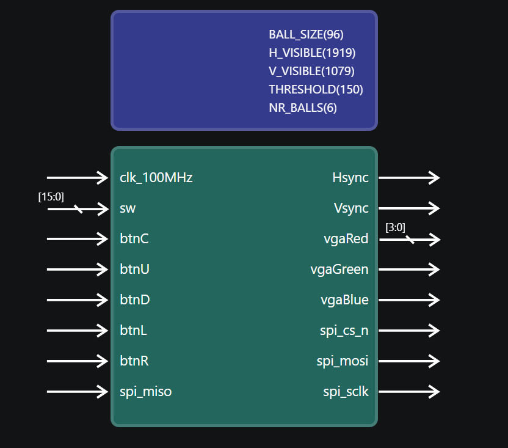
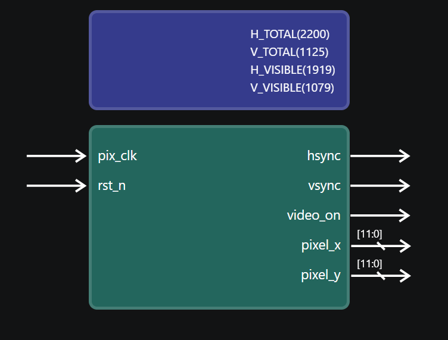
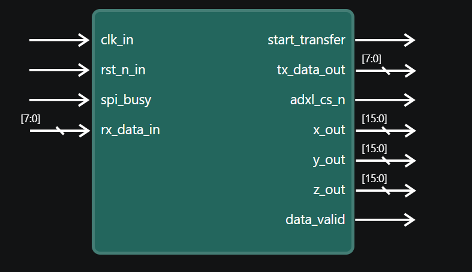
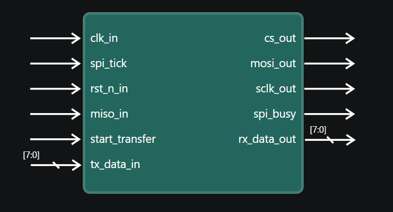
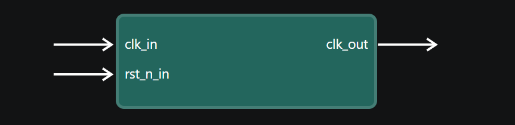
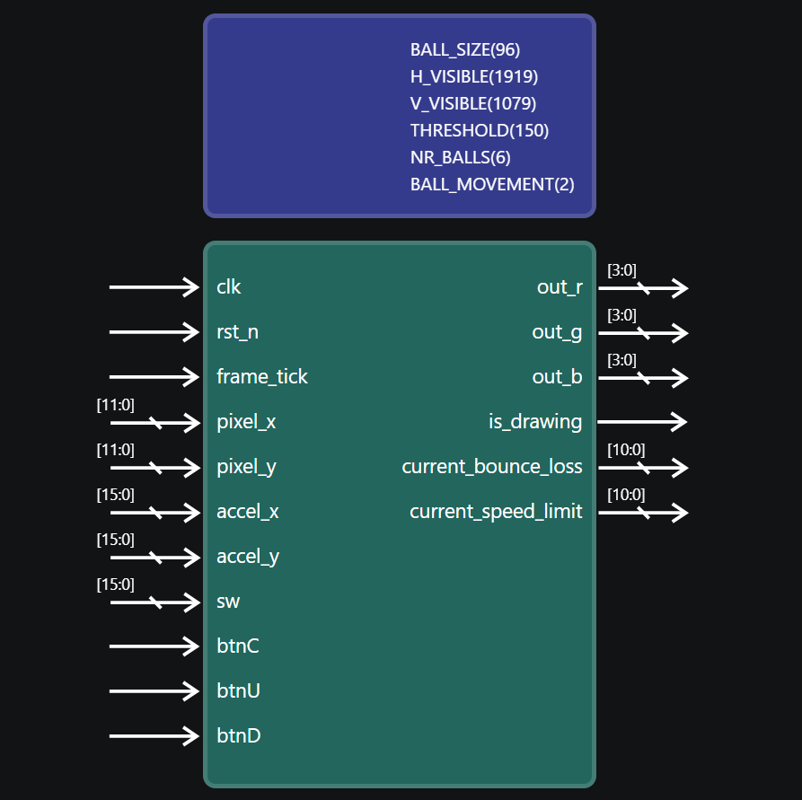
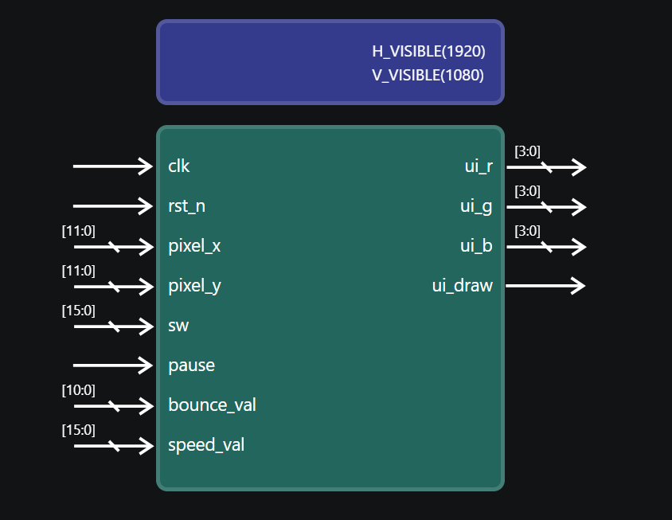

# Proiect: Hardware Particle Engine pe FPGA (Xilinx Basys 3)  
**Autor:** Gavra Luca-Mihai  

## Istoric Revizii Document (Revision History)

| Dată | Acțiune / Modificare Document |
| :--- | :--- |
| **07 Iul 2026** | **Versiunea 0.1:** Crearea fișierului README inițial (definirea structurii de bază, a contextului și a obiectivelor propuse). |
| **10 Iul 2026** | **Versiunea 0.2:** Revizia majoră a documentului. S-au completat etapele cu progresul realizat până acum (implementare VGA, depanare erori semnal/reset, detalii tehnice pentru logica de animație a pătratului și actualizarea statusului pentru obiective). |
| **20 Iul 2026** | **Versiunea 0.3:** Adăugarea Etapei 5 — integrarea senzorului de accelerație ADXL345 prin protocol SPI propriu (FSM master SPI + FSM de citire senzor), înlocuirea logicii de bounce determinist cu mișcare controlată de accelerație reală, legarea culorii de fundal de valorile senzorului, și upgrade-ul rezoluției video la 1920x1080. |
| **20 Iul 2026** | **Versiunea 0.4:** Adăugarea Etapei 6 — finalizarea motorului de fizică (viteză/accelerație explicite, coliziune circulară, bounce elastic cu pierdere de energie, extindere la 6 bile simultane). Eliminarea din Capitolul 1 a referințelor la resurse hardware neutilizate (BRAM, afișaj 7 segmente). Adăugarea notei privind controlul parametrilor bilelor din switch-uri (funcționalitate planificată, neimplementată încă). |
| **23 Iul 2026** | **Versiunea 1.0 (Finală):** Actualizarea completă a documentației pentru a reflecta starea finală și funcțională a sistemului hardware pe placă. S-au adăugat detaliile tehnice complete pentru Etapa 7 (Meniul UI OSD integrat direct în panoul lateral dreapta, sistemul de selecție a bilei individuale prin switch-urile 14-12, activarea conturului roșu de focus prin switch-ul 15, controlul individual și dinamic din butoanele plăcii pentru elasticitate și limita de viteză maximă cu comportament tip SHIFT via butonul central, și corectarea bug-urilor de jitter/sacadere pe axa Y prin optimizarea marjelor de corecție a coliziunilor). |

---

## Cuprins
- [Proiect: Hardware Particle Engine pe FPGA (Xilinx Basys 3)](#proiect-hardware-particle-engine-pe-fpga-xilinx-basys-3)
  - [Istoric Revizii Document (Revision History)](#istoric-revizii-document-revision-history)
  - [Cuprins](#cuprins)
  - [Capitolul 1. Introducere și Arhitectură](#capitolul-1-introducere-și-arhitectură)
    - [1.1. Context și Resurse Hardware](#11-context-și-resurse-hardware)
    - [1.2. Obiective Personale](#12-obiective-personale)
    - [1.3. Ce vreau să realizez (Obiectivele Proiectului)](#13-ce-vreau-să-realizez-obiectivele-proiectului)
    - [1.4. Descrierea Modulelor Sistemului](#14-descrierea-modulelor-sistemului)
      - [Modulul de Top (`vga_top`)](#modulul-de-top-vga_top)
      - [Controller-ul VGA (`vga_controller`)](#controller-ul-vga-vga_controller)
      - [Cititorul ADXL (`adxl_read`)](#cititorul-adxl-adxl_read)
      - [Mașina de Stări SPI (`spi_fsm`)](#mașina-de-stări-spi-spi_fsm)
      - [Divizorul de Ceas SPI (`spi_clk`)](#divizorul-de-ceas-spi-spi_clk)
      - [Motorul de Fizică (`game_logic`)](#motorul-de-fizică-game_logic)
      - [Interfața Grafică (`ui_overlay`)](#interfața-grafică-ui_overlay)
  - [Capitolul 2. Jurnal de Implementare pe Etape](#capitolul-2-jurnal-de-implementare-pe-etape)
    - [2.1. Etapa 1: Crearea Documentației și Planificarea](#21-etapa-1-crearea-documentației-și-planificarea)
    - [2.2. Etapa 2: Controller-ul VGA (Design și Simulare)](#22-etapa-2-controller-ul-vga-design-și-simulare)
    - [2.3. Etapa 3: Implementarea pe Placă și Depanarea](#23-etapa-3-implementarea-pe-placă-și-depanarea)
    - [2.4. Etapa 4: Feature Personal - Pătratul Animat](#24-etapa-4-feature-personal---pătratul-animat)
    - [2.5. Etapa 5: Senzor de Accelerație (SPI) și Fizică Reală](#25-etapa-5-senzor-de-accelerație-spi-și-fizică-reală)
    - [2.6. Etapa 6: Finalizarea Motorului de Fizică - Multi-Bilă, Coliziune Circulară și Bounce Elastic](#26-etapa-6-finalizarea-motorului-de-fizică---multi-bilă-coliziune-circulară-și-bounce-elastic)
    - [2.7. Etapa 7: Interfață UI OSD, Selecție Individuală și Control Dinamic al Parametrilor (Versiunea Finală)](#27-etapa-7-interfață-ui-osd-selecție-individuală-și-control-dinamic-al-parametrilor-versiunea-finală)
  - [Capitolul 3. Evaluare și Concluzii (Status Curent)](#capitolul-3-evaluare-și-concluzii-status-curent)
    - [Concluzii Intermediare](#concluzii-intermediare)

---

## Capitolul 1. Introducere și Arhitectură

### 1.1. Context și Resurse Hardware
Proiectul constă în dezvoltarea unui motor hardware de fizică 2D (Particle Engine) și a unui driver video VGA, scrise exclusiv în Verilog/SystemVerilog pentru placa **Digilent Basys 3**. Sistemul rulează direct pe siliciu, fără microprocesor sau sistem de operare. Pentru a susține acest motor grafic, ne bazăm pe următoarele resurse hardware ale plăcii:
* **DAC VGA (12 biți):** Permite generarea a 4096 de culori prin semnale analogice.
* **Switch-uri și Butoane:** Folosite ca interfață de control hardware (selectare culori RGB, selecție bilă activă, setare elasticitate și limită de viteză, activare contur vizual, pauză, reset).

**Schema Arhitecturală a Sistemului:**
Mai jos este prezentată diagrama bloc a sistemului, ilustrând interacțiunea dintre modulele de bază (VGA, SPI, Particle Engine și UI OSD) orchestrate de modulul de top `vga_top`:

  

 

### 1.2. Obiective Personale
Aceste obiective vizează strict dezvoltarea mea tehnică și înțelegerea conceptelor de inginerie hardware în mediul de lucru:

| Nr. | Obiectiv Personal | Criteriu de Succes |
| :--- | :--- | :--- |
| **OP1** | **Stăpânirea mediului Vivado** | Să pot crea proiecte, constrângeri și bitstream-uri fără asistență. |
| **OP2** | **Tranziția la gândirea hardware** | Să înțeleg diferența dintre execuția secvențială (software) și paralelismul hardware (semnale concurente). |
| **OP3** | **Îmbunătățirea tehnicilor de Debugging** | Să fiu capabil să deduc o eroare logică din comportamentul fizic al plăcii. |
| **OP4** | **Scrierea de cod curat (Bune practici)** | Să respect cu strictețe regula de "maxim un semnal actualizat per bloc always". |

### 1.3. Ce vreau să realizez (Obiectivele Proiectului)
Acestea reprezintă modulele funcționale și etapele tehnice pe care mi-am propus să le implementez fizic pe FPGA:

| Nr. | Obiectiv Proiect (Feature) | Descriere |
| :--- | :--- | :--- |
| **P1** | **Dezvoltarea Controller-ului VGA** | Proiectarea de la zero a generatorului de sincronizare HSYNC/VSYNC. |
| **P2** | **Afișarea Interactivă** | Controlul culorilor ecranului folosind switch-urile hardware. |
| **P3** | **Animație Geometrică de Bază** | Generarea unui obiect (pătrat) care se mișcă și ricoșează de marginile ecranului. |
| **P4** | **Hardware Particle Engine (Final)** | Implementarea matematicii în virgulă fixă pentru accelerarea mai multor particule concurente, completată cu o interfață UI pe ecran și control dinamic per bilă. |

### 1.4. Descrierea Modulelor Sistemului
Arhitectura sistemului este modulară, fiecare componentă având o funcție specifică. Mai jos sunt prezentate diagramele la nivel de porturi pentru fiecare modul cheie.

#### Modulul de Top (`vga_top`)
Acesta este modulul principal care integrează toate celelalte componente. El orchestrează semnalele de ceas, coordonează interfața SPI și gestionează ieșirea video către VGA, realizând multiplexarea între elementele de joc și interfața grafică (UI).

  

#### Controller-ul VGA (`vga_controller`)
Acest modul generează semnalele de sincronizare (`hsync`, `vsync`) respectând standardul de temporizare VESA. De asemenea, furnizează coordonatele curente ale pixelului (`pixel_x`, `pixel_y`) și un semnal `video_on` pentru a indica dacă pixelul curent se află în regiunea vizibilă a ecranului.

  

#### Cititorul ADXL (`adxl_read`)
Acest modul acționează ca un maestru logic pentru senzorul de accelerație ADXL345. Gestionează o mașină de stări (FSM) complexă pentru a scoate senzorul din regimul standby, a-l configura și apoi a citi continuu datele brute de pe axele X și Y, pe care le expune mai departe către logica jocului.

  

#### Mașina de Stări SPI (`spi_fsm`)
Este responsabil cu execuția fizică a protocolului SPI de nivel scăzut. Primește comenzi și date de la `adxl_read` și se ocupă de serializarea pe biți a semnalelor MOSI și MISO, generând totodată semnalul de *Chip Select* (`cs_out`).

  

#### Divizorul de Ceas SPI (`spi_clk`)
Reduce ceasul sistemului la o frecvență potrivită pentru protocolul SPI (5 MHz), necesar comunicării stabile cu senzorul ADXL345.

  

#### Motorul de Fizică (`game_logic`)
Modulul reprezintă centrul de calcul al proiectului. Calculează accelerația, viteza și poziția particulelor, detectează coliziunile (inclusiv cele circulare și impactul cu marginile ecranului) și determină culoarea fiecărui obiect în funcție de starea switch-urilor. Totodată, exportă parametrii selectați pentru a fi afișați pe interfața UI.

  

#### Interfața Grafică (`ui_overlay`)
Gestionează un panou lateral de meniu tip OSD. Desenează texte și simboluri direct la nivel de pixel pe ecran, interpretând valori numerice (cum ar fi elasticitatea sau viteza) și afișându-le într-un format vizual lizibil, fără să interfereze cu logica internă a jocului.

  

---

## Capitolul 2. Jurnal de Implementare pe Etape

### 2.1. Etapa 1: Crearea Documentației și Planificarea
* **Obiectivul (Ce am vrut să obțin):** Organizarea spațiului de lucru, definirea arhitecturii sistemului și structurarea pașilor de dezvoltare sub forma unei documentații tehnice clare.
* **Cum l-am obținut (Implementare):**
  * Am inițializat repository-ul proiectului.
  * Am creat fișierul `.md` curent pentru a ține evidența trasabilității cerințelor.
  * Am definiturat distincția dintre obiectivele de învățare (personale) și cerințele tehnice ale sistemului (Particle Engine).
* **Dificultăți întâlnite:** Clarificarea arhitecturii hardware necesare înainte de scrierea propriu-zisă a codului, pentru a evita refactorizările majore ulterioare.
* **Etapa următoare:** Generarea codului RTL pentru interfața video.

---

### 2.2. Etapa 2: Controller-ul VGA (Design și Simulare)
* **Obiectivul (Ce am vrut să obțin):** Proiectarea modulului `vga_controller` care să genereze semnalele de sincronizare (`hsync`, `vsync`) și coordonatele pixelilor (`x`, `y`).
* **Cum l-am obținut (Implementare):**
  * Am utilizat un **testbench** oferit de coordonatorii de practică, pe care l-am adăugat în secțiunea *Simulation Sources* din Vivado pentru a simula și verifica semnalele video, divizorul de ceas din testbench fiind deja configurat de aceștia.
  * Am implementat numărătoarele orizontale și verticale conform standardului VESA (640x480).
  * Am grupat logica de sincronizare într-un singur bloc secvențial.
* **Dificultăți întâlnite:** Găsirea parametrilor exacți pentru Front Porch, Sync Pulse și Back Porch astfel încât timpii simulați să corespundă standardului VESA.
* **Etapa următoare:** Conectarea fizică pe placă, implementarea IP-ului de ceas și generarea imaginii.

---

### 2.3. Etapa 3: Implementarea pe Placă și Depanarea
* **Obiectivul (Ce am vrut să obțin):** Maparea codului pe pinii fizici ai FPGA-ului, generarea hardware a ceasului, testarea pe un monitor real și afișarea unor culori statice controlate prin switch-uri.
* **Cum l-am obținut (Implementare):**
  * Am configurat IP-ul **Clocking Wizard** din Vivado pentru a genera frecvența extrem de precisă de **25.175 MHz** necesară monitorului, pornind de la ceasul principal de 100 MHz al plăcii.
  * Am setat parametrul de reset ca fiind **Active Low** direct din diagrama de wrapper a IP-ului, pentru a corespunde cu logica butoanelor/switch-urilor de pe placă.
  * Am creat manual fișierul de constrângeri `.xdc`, mapând porturile modulului de top la I/O-urile fizice ale plăcii Basys 3.
  * Am implementat logica combinațională pentru trimiterea culorilor către DAC-ul VGA și am încărcat bitstream-ul pe placă.
* **Dificultăți și Soluții (Troubleshooting):**

| Problemă Întâlnită | Cauză Identificată | Soluție Aplicată |
| :--- | :--- | :--- |
| **Eroare "No Signal"** | Conflicte de stare la semnalul de reset al divizorului de ceas. | Setarea manuală a polarității resetului pe **Active Low** în Clocking Wizard, prevenind blocarea ceasului. |
| **Eroare Bitstream** | Discrepanțe de scriere (majuscule/minuscule) în `.xdc`. | Corectarea denumirilor conform schemei Basys 3. |

* **Ce mi s-a părut interesant:** A fost momentul în care am înțeles că o eroare catastrofală (ecran negru total) pe hardware poate fi cauzată de o simplă setare a polarității de reset dintr-o interfață grafică (wrapper), detaliu complet invizibil în logica de cod scrisă manual.

---

### 2.4. Etapa 4: Feature Personal - Pătratul Animat
* **Obiectivul (Ce am vrut să obțin):** Trecerea de la culori statice la grafică dinamică, prin desenarea unui pătrat de 32x32 pixeli care se mișcă în diagonală și ricoșează de marginile ecranului (stil "DVD Bounce"), controlabil via switch (Play/Pause).
* **Cum l-am obținut (Implementare):**
  * Am separat logica de joc de controller-ul VGA.
  * Am utilizat 4 blocuri secvențiale complet separate (pentru `ball_x`, `ball_y`, `dir_x`, `dir_y`) pentru a respecta regula de programare curată (1 semnal / block).
  * Am condiționat actualizarea coordonatelor de un semnal `frame_tick` (Front VSYNC) pentru a evita efectul de rupere a imaginii (tearing).
* **Dificultăți și Soluții:**

| Problemă Întâlnită | Cauză Identificată | Soluție Aplicată |
| :--- | :--- | :--- |
| **Mișcare invizibilă** | Viteza de calcul (25.175 MHz) era prea mare pentru refresh rate-ul monitorului. | Sincronizarea mișcării strict cu finalul desenării cadrului (60Hz). |

* **Ce mi s-a părut interesant:** Modul atipic de a genera elemente grafice. Spre deosebire de software, unde folosim funcții de desenare, în hardware pătratul a fost generat pur și simplu verificând continuu o inegalitate logică (între numărătoarele de pixeli curente și registrele de memorie ale obiectului).
* **Etapa următoare:** Transformarea logicii de mișcare liniare a pătratului în logica accelerată necesară pentru **Particle Engine**.

---

### 2.5. Etapa 5: Senzor de Accelerație (SPI) și Fizică Reală
* **Obiectivul (Ce am vrut să obțin):** Înlocuirea logicii de bounce determinist (viteză fixă, direcție binară) cu o mișcare controlată de date reale, provenite de la senzorul de accelerație **ADXL345**, citit printr-un protocol **SPI** implementat de la zero. În paralel, am urmărit și un upgrade al rezoluției video, de la 640x480 la **1920x1080**.
* **Cum l-am obținut (Implementare):**
  * Am proiectat propriul divizor de ceas SPI (`spi_clk`), care generează, dintr-un ceas de 25MHz, semnalul de tact necesar liniei SCLK a protocolului SPI.
  * Am implementat un FSM master SPI (`spi_fsm`), cu 4 stări (`IDLE`, `START`, `TRANSFER`, `STOP`), responsabil de trimiterea/recepția pe bit a datelor pe liniile MOSI/MISO.
  * Am scris un al doilea FSM, mult mai complex (`adxl_read`), care gestionează întreaga secvență de comunicare cu senzorul: trezirea acestuia din regimul standby, scrierea regiștrilor de configurare, și apoi citirea repetată, în buclă, a valorilor de accelerație de pe axele X și Y.
  * Am extins IP-ul Clocking Wizard cu o a doua ieșire de ceas, de **148.5MHz**, necesară noii rezoluții de 1920x1080 (temporizare standard VESA pentru Full HD).
  * Am înlocuit complet logica veche de `dir_x`/`dir_y` cu o mișcare condiționată de valoarea absolută a accelerației citite pe fiecare axă (comparată cu un prag `THRESHOLD`), direcția fiind dedusă din bitul de semn al valorii primite de la senzor.
  * Am legat culoarea de fundal a ecranului (`bg_red`/`bg_green`/`bg_blue`) direct de valorile de accelerație (stabilizate o dată pe cadru, în registrele `stable_x`/`stable_y`/`stable_z`), înlocuind controlul anterior prin switch-uri.
* **Dificultăți și Soluții:**

| Problemă Întâlnită | Cauză Identificată | Soluție Aplicată |
| :--- | :--- | :--- |
| **Valori de accelerație instabile ("zgomotoase")** | Cele două domenii de ceas diferite (25MHz pentru SPI, 148.5MHz pentru VGA) nu erau sincronizate explicit, iar datele brute de la senzor erau citite continuu, fără nicio stabilizare temporală. | Am eșantionat valorile de accelerație o singură dată pe cadru (`frame_tick`), stocându-le în registrele `stable_x`/`stable_y`/`stable_z`, eliminând tremurul vizual cauzat de citirea neîntreruptă a senzorului. |
| **Senzorul returna doar zerouri la citire** | Ordinea greșită de secvențiere a comenzilor către ADXL345 — încercam să citesc datele de accelerație înainte ca senzorul să fie efectiv scos din regimul standby și configurat corect. | Am structurat FSM-ul `adxl_read` cu stări dedicate, explicite, de trezire și configurare (`WAKE`, `WAKE_ADDR`, `WAKE_DATA`), executate strict înaintea stărilor de citire propriu-zisă (`REQ_X_L`, `REQ_X_H` etc.). |
| **Comunicare SPI instabilă / date corupte pe MISO** | Timing-ul liniei SCLK, generat inițial de `spi_clk`, nu respecta toleranțele impuse de datasheet-ul senzorului pentru viteza maximă de tact SPI. | Am recalibrat contorul din `spi_clk` pentru a obține un SCLK stabil de aproximativ 5MHz, în limitele acceptate de ADXL345. |

* **Ce mi s-a părut interesant:** Diferența majoră față de etapa anterioară — acolo controlam mișcarea printr-o logică complet determinist (bounce fix, viteză constantă), pe când aici mișcarea depinde de un semnal fizic real, extern, cu propriul lui zgomot și propriile lui întârzieri de comunicare. A trebuit să gândesc sistemul nu doar ca logică digitală pură, ci și ca o interfață cu lumea analogică/fizică din jur.
* **Etapa următoare:** Introducerea explicită a vitezei și accelerației ca stări separate de poziție, adăugarea elasticității la coliziunea cu pereții, și extinderea la mai multe particule/bile independente.

---

### 2.6. Etapa 6: Finalizarea Motorului de Fizică - Multi-Bilă, Coliziune Circulară și Bounce Elastic
* **Obiectivul (Ce am vrut să obțin):** Extinderea de la o singură bilă controlată de accelerometru (Etapa 5) la un motor de fizică complet — cu viteză și accelerație explicite, coliziune reală de tip cerc, bounce elastic cu pierdere de energie la pereți, și rulare simultană a mai multor bile independente. Finalizarea obiectivului **P4 (Hardware Particle Engine)**.
* **Cum l-am obținut (Implementare):**
  * Am introdus parametrul `NR_BALLS` (setat la 6) și am transformat registrele de poziție și viteză (`ball_x`, `ball_y`, `vel_x`, `vel_y`) în **array-uri**, indexate de la 0 la `NR_BALLS-1`.
  * Am adăugat viteză explicită cu semn (`logic signed`), separată de poziție — accelerația citită de la senzor incrementează sau decrementează viteza, plafonată la o limită maximă.
  * Am implementat **bounce elastic cu pierdere de energie**: la coliziunea cu un perete (detectată folosind aritmetică cu semn explicită, `$signed`), viteza se inversează și se atenuează după coeficientul `bounce_loss`.
  * Am înlocuit complet hitbox-ul pătrat cu o **coliziune circulară reală**: calculez distanța la pătrat de la centrul fiecărei bile la pixelul curent, într-un bloc `always_comb` cu buclă `for` peste toate cele `NR_BALLS` bile.
  * Am **pipelinat** ieșirea de culoare (`vgaRed`/`vgaGreen`/`vgaBlue`) într-un bloc `always_ff`, sincronizată cu `clk_148MHz`, pentru a evita hazardurile la frecvența înaltă din Full HD (1920x1080).
* **Dificultăți și Soluții:**

| Problemă Întâlnită | Cauză Identificată | Soluție Aplicată |
| :--- | :--- | :--- |
| **Bilele "explodau" spre viteze foarte mari** | Fără o valoare maximă impusă vitezei, accelerația acumulată putea duce vitezele la valori nerealiste. | Plafonarea explicită a vitezei maxime per bilă. |
| **La coliziune, bilele treceau ușor prin marginea ecranului** | Verificarea folosea poziția curentă, nu poziția viitoare (după aplicarea vitezei). | Calcularea poziției viitoare cu semn *înainte* de clamping-ul la graniță. |

* **Ce mi s-a părut interesant:** Bucla `for` din SystemVerilog, în acest context, se desfășoară (unrolls) la sinteză, generând efectiv circuite fizice paralele pentru fiecare bilă.

---

### 2.7. Etapa 7: Interfață UI OSD, Selecție Individuală și Control Dinamic al Parametrilor (Versiunea Finală)
* **Obiectivul (Ce am vrut să obțin):** Adăugarea unui panou informativ grafic (On-Screen Display / UI) în partea dreaptă a ecranului (rezervat între x=1520 și 1919), implementarea selecției individuale a bilelor prin switch-uri hardware dedicate, vizualizarea prin contur roșu a selecției curente și controlul individual/dinamic, în timp real, al elasticității și al vitezei maxime pentru fiecare bilă folosind butoanele plăcii.
* **Cum l-am obținut (Implementare):**
  * Am creat modulul dedicat `ui_overlay`, care randează în timp real un fundal texturat, titluri, starea comutatorului de pauză, starea celor 16 switch-uri hardware ale plăcii (codate pe culori pe grupuri de biți RGB și Default) și citiri textuale numerice directe pentru **Elasticitate** (`Elast: X`) și **Limită de viteză** (`Speed: YYY`), folosind fonturi rasterizate vectorial în funcții SystemVerilog.
  * Am reconfigurat maparea switch-urilor în `game_logic`: switch-urile **SW[14:12]** sunt folosite exclusiv pentru a selecta activ una dintre cele 6 bile (`NR_BALLS = 6`). Switch-ul **SW[15]** activează/dezactivează un **contur roșu estetic** în jurul bilei selectate pe ecran, calculat prin inegalități geometrice de rază.
  * Am implementat un sistem de tip **SHIFT hardware** folosind butonul central (`btnC`):
    * Dacă apeși scurt **`btnC`**, culoarea combinată din switch-urile **SW[11:0]** (R pe 4 biți, G pe 4 biți, B pe 4 biți) se aplica instantaneu pe bila selectată prin SW[14:12].
    * Dacă **ții apăsat `btnC` (ca tasta SHIFT)** și apeși **`btnU` (Sus)** sau **`btnD` (Jos)**, modifici direct **limita maximă de viteză** a bilei selectate.
    * Dacă apeși **`btnU`** sau **`btnD`** *fără* să ții `btnC` apăsat, modifici clasica **elasticitate** (`bounce_loss`) a bilei respective.
  * Am remediat o problemă de sacadare (jitter) pe axa Y observată la anumite bile (cum ar fi bila 2) când se aflau stivuite la baza ecranului, ajustând fin logica de corecție a coliziunilor la margini și a distanțelor de respingere între particule.
* **Dificultăți și Soluții:**

| Problemă Întâlnită | Cauză Identificată | Soluție Aplicată |
| :--- | :--- | :--- |
| **Erori de sinteză în Vivado legate de cuvântul cheie `automatic`** | Declararea de variabile temporare direct în interiorul blocurilor `always_comb` din modulul UI încălca regulile stricte de sinteză hardware ale toolset-ului. | Mutarea și declararea globală a variabilelor de calcul al cifrelor textuale la începutul modulului, în afara blocurilor procedurale combinate. |
| **Mișcare sacadată / jerky specifică pe axa Y pentru o singură bilă** | Suprapunerea forțelor gravitaționale cu micro-corecții prea mici sau prea agresive de respingere la contactul dintre bile (overlap resolution) crea o buclă de oscilație verticală. | Optimizarea marjelor de corecție a poziției în blocul de detecție a pereților și a coliziunilor multiple. |

* **Ce mi s-a părut interesant:** Crearea unei interfețe grafice de tip OSD (On-Screen Display) desenată pixel cu pixel direct prin logici de decodare a caracterelor în VESA Full HD, combinată cu un multiplexor de control de tip SHIFT bazat pe un singur buton fizic, a transformat proiectul dintr-o simplă simulare într-un produs interactiv complet autonom pe FPGA.

---

## Capitolul 3. Evaluare și Concluzii (Status Curent)

| Obiectiv (Personal / Proiect) | Status | Observații / Progres |
| :--- | :--- | :--- |
| **OP1:** Stăpânire Vivado | **Realizat** | Generarea bitstream-ului, a IP-urilor și a mapărilor XDC este complet naturală. |
| **OP3:** Depanare hardware | **Realizat** | Identificarea și remedierea bug-urilor de ceas, reset și jitter geometric. |
| **P1:** Controller VGA | **Realizat** | Modulul `vga_controller` este stabil, validat prin testbench și randare Full HD (Etapa 2 & 5). |
| **P2:** Afișare Interactivă | **Realizat** | Switch-urile și panoul UI OSD controlează dinamic culorile, stările și parametrii fizici (Etapa 3 & 7). |
| **P3:** Feature (Animație Pătrat) | **Realizat** | Trecut cu succes de la pătrat simplu la motor fizic complet cu particule multiple (Etapa 4-6). |
| **P4:** Particle Engine | **Realizat** | Motorul hardware multi-bilă rulează integral pe placă, cu fizică de coliziune, accelerometru SPI și interfață OSD completă (Etapa 6 & 7). |

### Concluzii Intermediare
Proiectul a evoluat cu succes de la o simplă structură de fișiere și simulare de semnale video până la un **Hardware Particle Engine** complet interactiv, implementat integral pe o placă FPGA Xilinx Basys 3. Integrarea cu succes a protocolului SPI pentru citirea accelerometrului ADXL345, crearea unui motor fizic cu array-uri paralele de bile, adăugarea unei interfețe grafice de tip OSD și a unui sistem de control dinamic pe canale multiple transformă acest proiect într-o demonstrație solidă de arhitectură hardware și gândire paralelă în SystemVerilog. Baza de cod este robustă, curată și pe deplin funcțională.